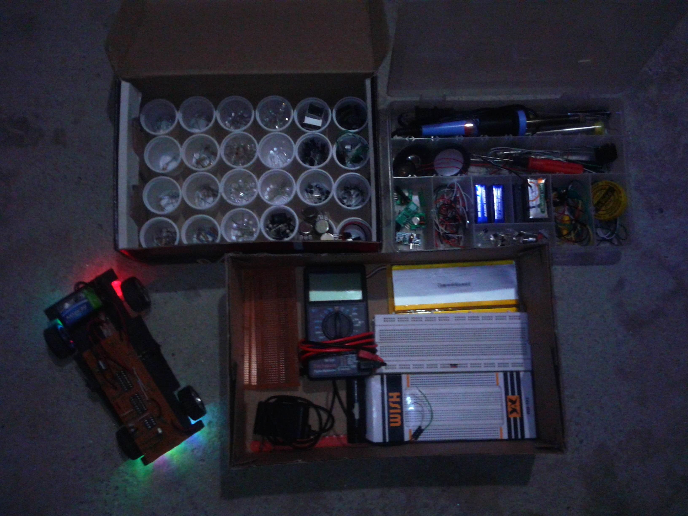
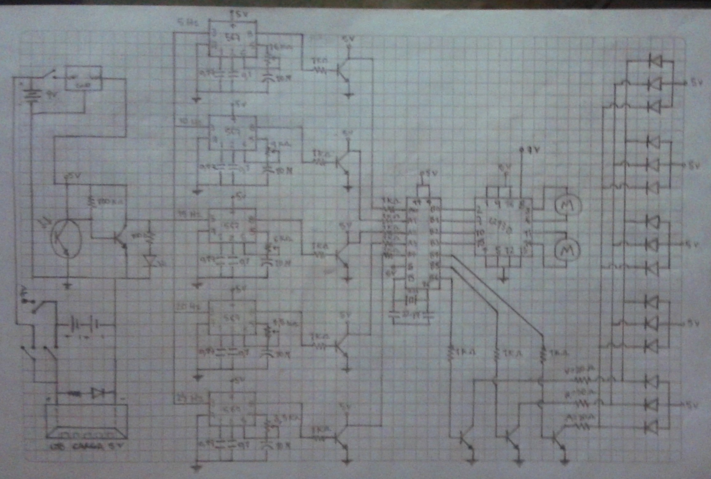
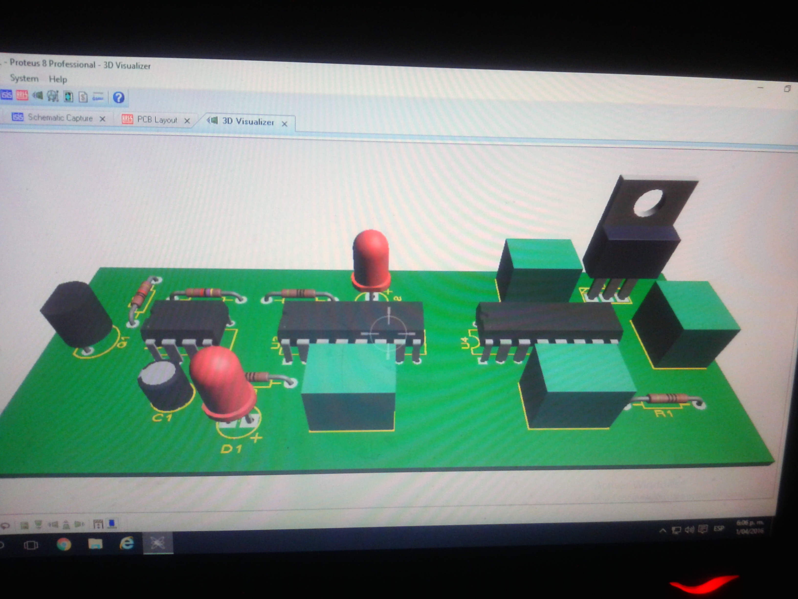
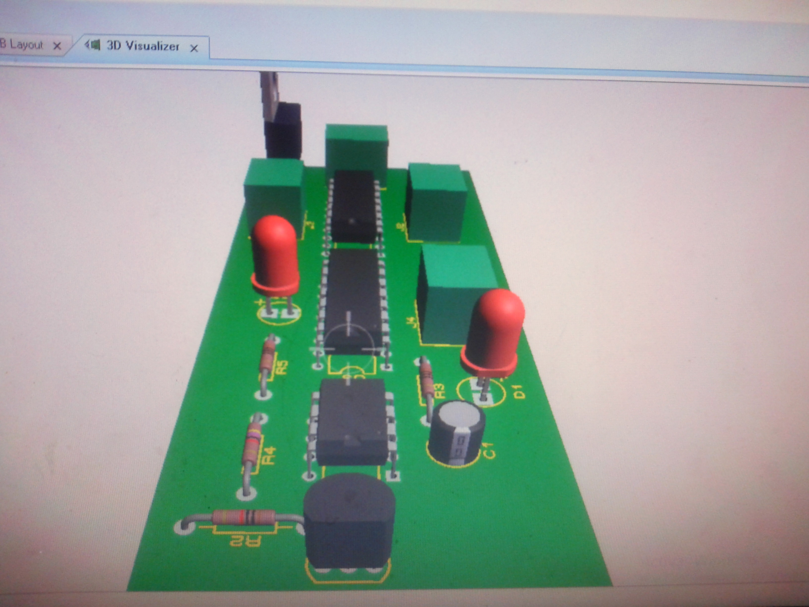
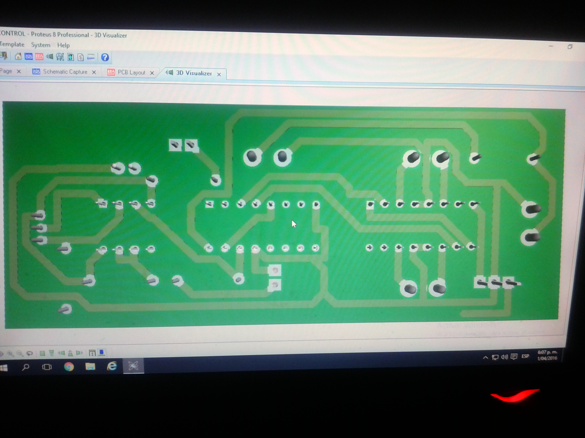

# RC CAR

## Summary
- High-school project in 2016 
- Remote Control Car with IR communication
- Old-school 8-bit PICs designs
- Simple 1-layer PCB layout

## Description
My journey into electronics began when I was a child. I have always been deeply interested in understanding how things work, and I still remember the science fair project where my father and I built a simple circuit with an alkaline battery, a switch, and a lamp to demonstrate how electricity works. That was an amazing experience for me back in fourth or fifth grade (I’m not entirely sure which).

Then, in sixth grade at school, I made a brush robot, and I was beyond excited to see what a battery and a motor could do. From that point on, my curiosity about the world of electricity and electronics kept growing and growing.

I attempted to make a wind farm using some motors and LEDs, only to burn them out by not using any resistors. I also tried to make an electric boat to play with friends, but it ended up short-circuiting at the bottom of my grandmother's water tank. Project after project, I continued discovering this fascinating world—even trying to write a book in high school to consolidate all the knowledge I had gained until that point and help other students with the basics. It was a crazy idea, for sure!

This curiosity, combined with my passion for remote control (RC) cars (another interesting story), led me to create my own RC cars using my basic electronics knowledge back in 10th grade.

At first, I tried using infrared (IR) communication with a transistor to control the motor. It was fun to learn how IR works by using a simple IR LED and a photodiode polarized inversely to receive the signal from the emitter.

This solution was simple but came with many practical problems. The main issue was the transmission distance. With conservative polarization, it could only reach 5 to 8 meters. When I tried to extend that range by increasing the reverse current, the car became unstable and uncontrollable due to solar light noise during the day. As a result, the car was only usable at night. Additionally, the emitter could only send one instruction—to go straight. That might sound a little dull, but hey, it was my very first RC car!

My electronic lab setup in 2016 and my own IR car with flashing RGB lights:

After that initial experience, I decided to study more about improving my design to make a better car. Motivated by this, I eventually ended up using a universal transmitter from a TV remote and a phototransistor with a 38kHz filter to demodulate the signal. This was a significant improvement in the design, along with the addition of a transistorized H-bridge for motor control, allowing more commands over longer distances. This version was far more fun than the earlier one.

I even drew the shematics with pen and paper at that time

In 2016, I formally began studying electronics at my high school, where I learned about microcontrollers and a variety of components. I began to understand how these components work and how to use them in circuits. I designed the PCB for this project and here I could recover the 3D renders of that first PCB:

I began to design with Proteus Professional. For my firsts PCB designs I had to iron and do the etching process of the PCBs by hand in the school laboratory. Sadly, I don’t have any photos of the final car. However, I did present my modern and very fast RC car at an inter-school robotics fair at the end of 2016. That car brought me a lot of fun and even more knowledge about electronics, solidifying why this field is my passion. It likely ended up in my personal graveyard of dismantled old toys and RC cars.