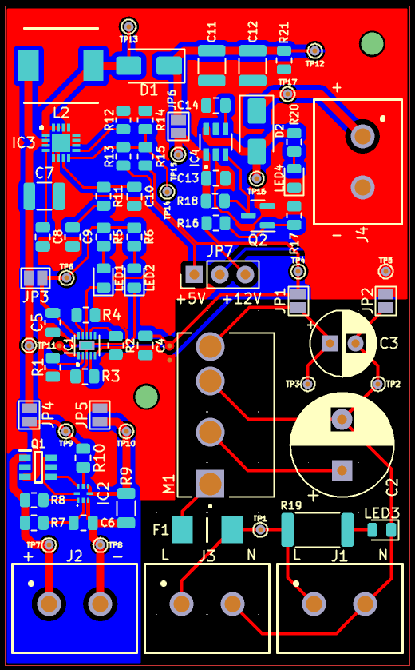
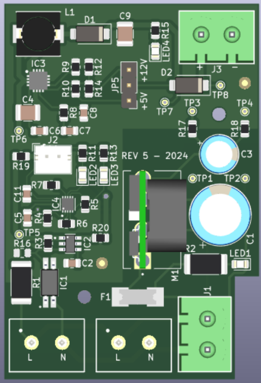

# SMALL-UPS

## Summary
- Small UPS for monitoring equipment
- Different power converter topologies
- Product iterations in hardware design
- Interesting battery-related system
- Compact 2-layer, 42mm x 62mm PCB

## Description
This interesting project was maybe my first complete design fully focused on battery and power management systems. The requirement was to design an add-on device to allow a monitoring equipment to operate even without direct AC power from an electric outlet. The monitoring equipment uses internally 110–220VAC to convert to 5–12VDC and power all of its internal circuitry. The autonomy target was 8 hours because this new device has to guarantee that the equipment continues its operation during long power outages and without interruption.

The solution I proposed for this uses a single-cell Li-ion rechargeable battery. This implies the use of a DC-DC boost converter to get 5 or 12VDC at the output, selectable with a removable jumper. When the UPS is connected to the mains, it charges the battery and lets the 110–220VAC pass to power up the monitoring equipment. And when there is no power input, it activates the battery and boost converter to deliver DC voltage to the output (a classic backup power system operation). To do this, I designed a load switch circuit activated with an optocoupler to detect the AC power. Also, I had to use an AC-DC converter to charge the battery at 5VDC.

Photo of first PCB design with a lot of placement and routing improvement

This design had a lot of iterations, it was a big learning curve with every circuit of the design: the battery charger configuration, the boost converter operation, the output protection, the thermal management, etc. The first designs were really hot, and the change from AC to battery-powered wasn't smooth, then the monitoring equipment was reset with each power outage. Then I had a problem with the battery charging time because the AC-DC converter was small and had lower power capacity (less than 1.5W). I had to sort these problems with recalculations and spins in the prototyping stage of the project.

Photo of final design with big changes in shape, routing, and of course operation

Finally, the complete system tests were passed, all requirements were met, and the device operated successfully. The development of this equipment took more or less 4 months, a bit long for this type of device, but the final result left us very happy. Unfortunately, this technology never went to field testing or even deployment because our client decided to explore other commercial-ready alternatives to solve his initial problem.

I don't see this project as a failure. Maybe it is not our objective as engineers or product developers, because we want to create solutions for the real world that have an impact in some way. But even these projects that ended up in development and never reached production teach us a lot of things that we can apply later. This real hands-on experience is very valuable to grow and improve.
