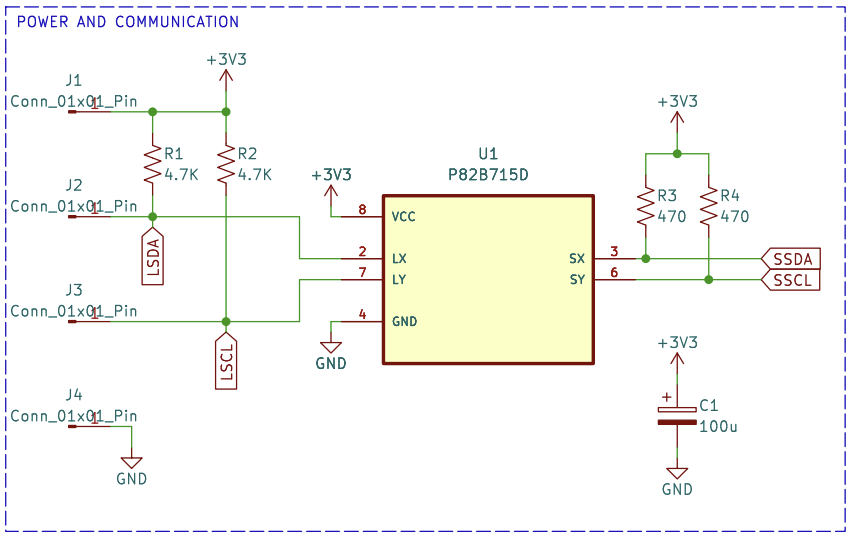
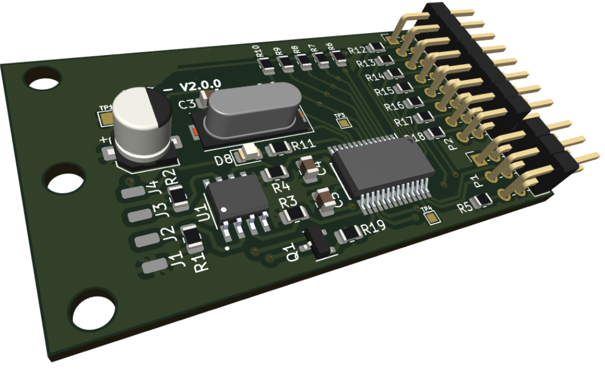

# KEYBOARD CONTROL

## Summary
- Membrane keyboard interface
- Long cable I2C port communication
- Modern low-power 8-bit PIC microcontroller
- 2-layer PCB designed with KiCad in 2023
- Gaming industry

## Description
Sometimes, you have to design the entire system, but other times, it's about adding new features or devices to complement the operation of a main device. In this case, it was the latter. This project was an add-on to an already established board that controls telemetry in gaming machines. The goal was to design a new membrane keyboard interface to integrate a fidelity mechanism, rewarding recurrent users of these machines.

The critical aspect of this small board was its integration with the main one, which had only a single I2C port available to communicate with the membrane keyboard. Additionally, the device needed to be installed 1 to 1.5 meters away from the main board. The primary concern was ensuring the serial protocol would perform effectively over that distance, so the initial phase of the design focused on addressing this challenge. After thorough research and validation, the well-known I2C bus extender chip P82B715 from Texas Instruments was selected.

Final P82B715 circuit used in the design

The beauty of this circuit is the magic behind with the calculations for bus capacitance and rise time of I2C signals. Finally, this design worked without interruptions in the communication between processors on both boards. However, the power losses in the cable was a concern due to its length and the low voltage application. To manage this, the hardware try to save precious miliamps in passive selection and the firmware was focused on low-power consumption from the MCU core.

Final PCB render

The final view of the board includes pin headers for the I2C bus and keyboard connection, along with mounting holes for mechanical support. Projects like this often come with intriguing challenges that require diving into the finer details of specific circuits. This particular design provided an excellent opportunity to research the protocol for wired applications and debug the final design by carefully fine-tuning values and parameters.

Note: Sadly the P82B715D chip reference is obselete now (28/04/2025)