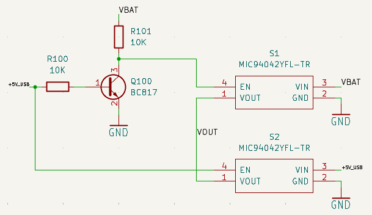
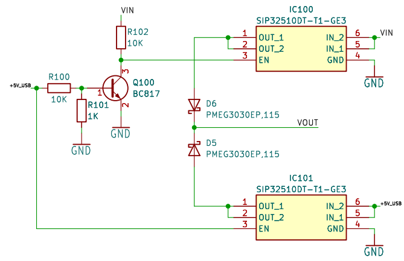

# POSITIONING SYSTEM

## Summary
- Satellital positioning system
- Military application
- ATMEGA based design
- Battery, USB-C and GPS circuits
- PCB designed with KiCad in 2023

## Description
There are projects that you did not start, but you have to finish. This is one of those. The initial design was created for this client a couple of years before I joined the company. The client delayed testing the equipment, and when they came back with some improvement opportunities and adjustment requests, the engineer in charge was no longer with the company. I attended to this client and took note of their new requirements for the device. They wanted a satellite positioning system based on a Iridium module with GPS, a backup battery, and a few other features.

When I received the original design, there was not much documentation or technical information about the project. All I had were the editable CAD files. This was the first challenge, because it takes time to understand a design created by someone else and try to grasp the technical background behind the components and circuits. Additionally, when the client brought the field test boards, some power tracks on the PCB were blown out due to high current peaks in the wireless modules. Also, the battery charger didn’t work properly, and the client wanted the device to be always plugged in without needing to change any settings to charge the battery and power the system.

Initial circuit proposed for backup hot-switch power system

Those 1.2mm x 1.2mm FDFN packages gave me a lot of trouble, and a redesign was needed. The MIC94042 load switches I initially chose didn’t have reverse voltage protection, so the system had +5V_USB even when no USB was connected. This led to malfunctions in the switches, overheating those small chips and cutting off power to the actual circuitry of the board. These problems with the current version of the design were significant, but at first, I tried to fix them with cosmetic changes to avoid engineering overcosts and provide a quick solution to the client. Big mistake! The design was originally created, at the client's request, around an ATMEGA2560. Other components in the system operated at different voltage levels, so the board not only had issues with the power stage, but also with the internal communication buses. This was something the client wasn’t aware of and caused random operational errors.

Redesigned load switch circuit with new references

I redesigned the backup circuit using new load switches (with more user-friendly packages and additional protections), and this part worked properly. After that, I corrected several other issues on the board at both schematic and layout levels. These changes required two iterations and a lot of meetings with the client, including some heated discussions about how to manage this project without burning out.

Final view of the board

Finally, we were able to deliver a working board to the client, which was properly tested in the lab by us and validated in the field by the client. These complicated projects are the ones where we learn the most from our own mistakes and from others'. This project also taught me a lesson I’ll never forget: Always document everything, and always review the entire design when you’re responsible for ensuring the quality and operation of a hardware system, especially when you’re not the original designer.