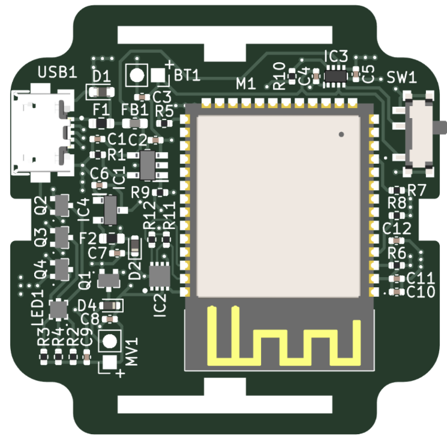
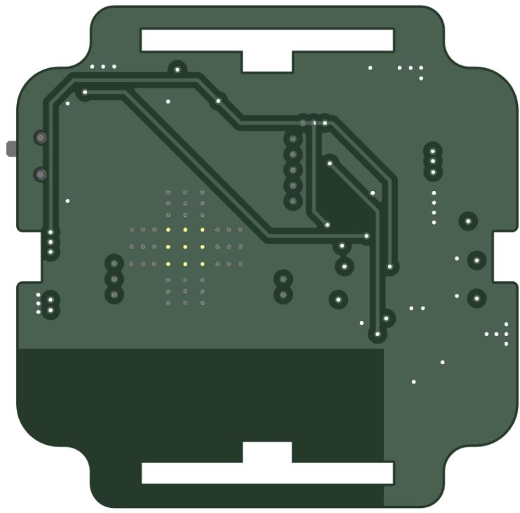

# SMART TAG

## Summary
- Smart tag for indoor tracking and logistics
- ESP32 based product
- Portable device with battery and USB charger
- 4-layer stackup
- 2023 KiCad design

## Description
This special board was my first 4-layer PCB. I mainly chose that stack-up because of space constraints and the number of components. This PCB is 40 x 40 mm, the size of a modern smartwatch, and that was our main goal: to create a portable device that is small and easy to carry. The board has 44 components, including some small 0402 passives. The USB Micro B was a requirement from the client to match their operational capabilities and equipment. The design process for this board was straightforward because the initial requirements were clear, and the complexity of the device stemmed more from its size than its electronics.

This bracelet has WiFi and Bluetooth connectivity, thanks to the ESP32 module. Additionally, this SoC controls some peripherals, like an RGB indicator LED and a vibration motor. A special part of this design was the power management system, as we had to add a fuel gauge IC for battery monitoring. We also had to integrate a battery charger and other components to ensure seamless operation, whether powered by battery or connected to a USB adapter. When the device is connected for charging, it must remain functional if the master switch is ON. This feature simplifies operation for fixed devices that need to stay connected at all times, with the battery acting as a backup power system rather than the primary source.

This equipment has a dual role in the client's application. Some devices function as APs, installed in fixed locations and generating networks to detect other nearby devices. Other devices serve as tags that operators wear to track their activity. Initially, our goal was to create a proof of concept to present to potential investors for our client and convince them to scale the project. When we released the initial prototype, we were pleasantly surprised: it worked flawlessly, with no failures, issues, or electrical problems in the hardware. That made me incredibly happy because achieving a 100% working prototype on the first attempt is a major accomplishment in hardware design. Clearly, that’s the goal of every hardware designer in the world, but in my experience, it’s rare, perhaps only 1% of designs work perfectly from the start.

Seeing my first 4-layer PCB design pass all hardware tests for power, communications, peripherals, etc., was truly amazing. From that point, all that remained was the firmware. After a few months, the device was ready for field tests, and we had a proof of concept bearing the client's name. Of course, having functional hardware on the first attempt doesn’t mean the product iteration is complete. After field testing, we will likely have improvements to make to enhance reliability, practicality, and user experience. For now, here are some pictures of this small piece of technology, packed with industrial and commercial applications that are yet to come.

