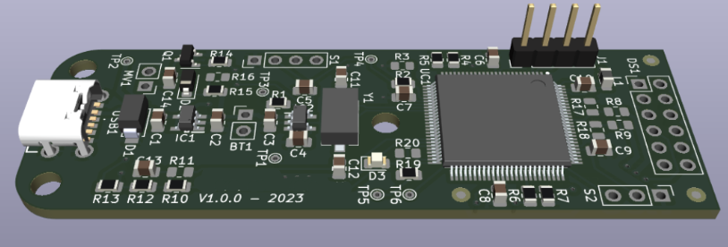
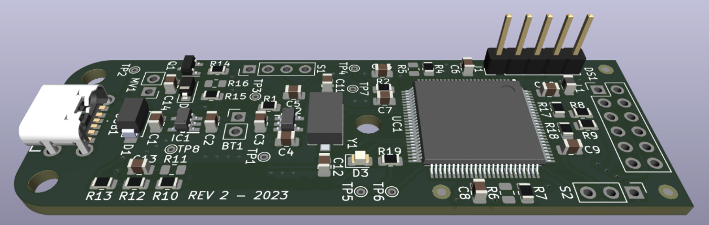

# SMART ROPE

## Summary
- Smart rope device for fitness uses
- Portable consumer electronics
- ATMega based with different sensors and actuators
- 2 layer 2oz PCB for low-power application
- KiCad design in 2023

## Description
In this job, when you have to work with a lot of clients (entrepreneurs, product developers, small and big companies), you see several project problems. This case is a very typical one. The client of this project had some experience in product development, but not so much with the electronics part. Because of that, he hired a freelance engineer to develop a prototype of this system. But what a surprise for our team when the client brought us a protoboard with an Arduino Mega wired up with jumpers and a lot more stuff. Maybe that deliverable could be acceptable for an initial proof of concept, but not for a prototype of a portable device which had to go in a casing the size of a jump rope handle.

The client came to us convinced that the project needed very little to go from what he had to an MVP (Minimum Viable Product). The reality was strikingly different. And that's the problem with this kind of job: it is difficult to clearly define the scope and the deliverables when you don't know what the project should be. Then it is also difficult to convince a client that his investment up to that moment had been practically wasted, and that we had to redo a lot of work from scratch but with a new focus and objective.

So we put our hands to work, trying to define what the project should be, what the product requirements were, what the target price and the client’s expectations with this product were, etc. Finally, we proposed to him a workaround with a clear schedule and deliverables. With that in mind, we started working. This new device should have a USB-C connector and battery to power up the system. We decided to keep the ATMega microcontroller and add all peripherals connectors. For this project, we had a very tight budget, so we had only one chance to prototype with 5 units and make the prototype work at +90% to give the client a functional device that could be presented and exposed to future project investors.

First version of the board

I designed a first complete version, but it was not manufactured. Instead, we used that design to present to the client, to adjust with the mechanical designer the final shape of the board, to peer-review the design in schematic and layout, etc. All of this meticulous work was in favor of refining the design as much as possible before prototyping it. We only had one shot. In the end, we could refine some details and confidently move on to prototyping the second version.

Second version of the board (very little changes and adjustments)

We prototyped 5 units of this version, and according to our initial requirements, the testing phase was successful. However, these types of projects are never static, and when we finally completed the manufacturing, the client wanted to change some requirements to get a better product for the following phases. Unfortunately, we couldn't adjust the hardware design to meet these new requirements, so we had to work with what was already there. I made some physical changes to the boards, wiring new connections and cutting some traces, and all the rest was handled, as much as possible, in the firmware.

At the end of this project, the device looked very different from our initial approach, but it was as the client wanted. Clearly, at a low level, the device was not 100%, a bunch of things had to be changed on the fly, and the technical debt was there. But for a first functional prototype of a device with a lot of potential and room for improvement, the project was completed satisfactorily.

PS: I can't show a view of the final product because this device has not been released to the market yet.