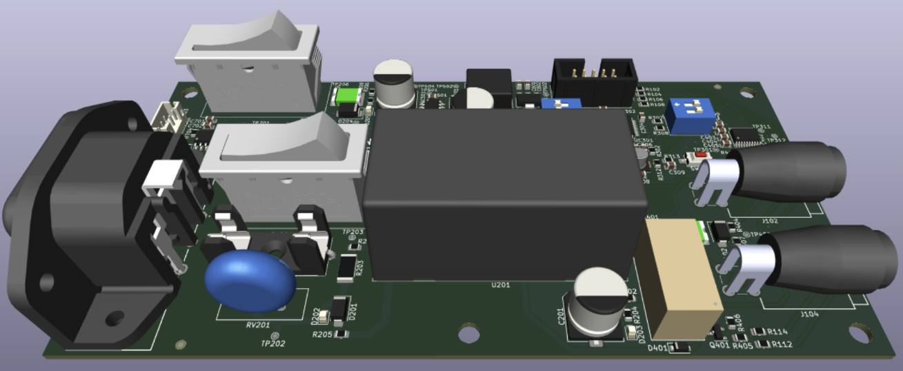
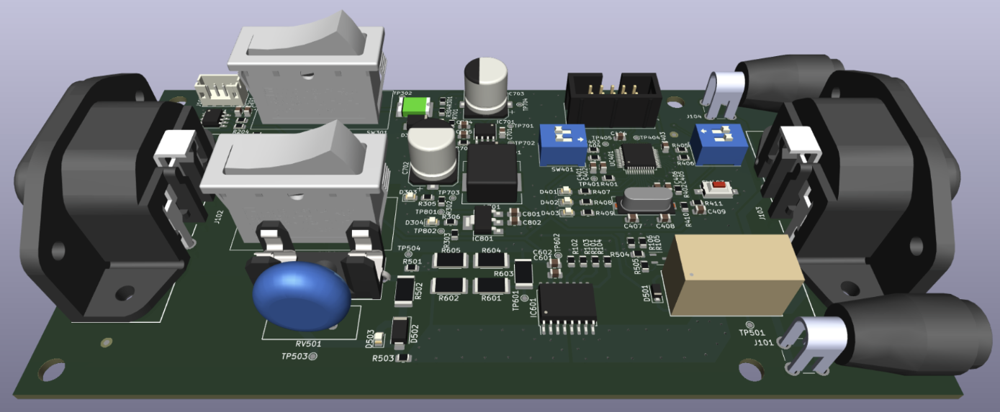
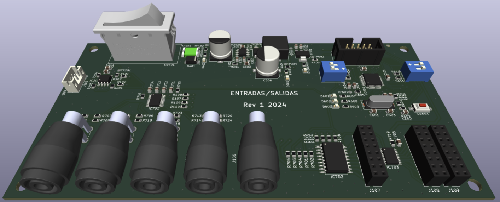
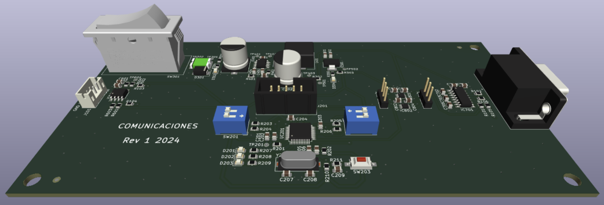

# TESTING EQUIPMENT

## Summary
- QC equipment for electronics manufacturing
- Instrumentation and Laboratory equipment
- Modular and flexible system based on modules
- Raspberry Pi and Microcontroller integration
- 5 PCBs designed for the first prototype in 2024

## Description
My role in this project was primarily as a some sort of technical leader, working with two other engineers on the team. Our goal was to build a machine to automate and optimize the quality control tests in the company's manufacturing area. These tests were typically performed manually by an operator. With this system, the idea was to automate the electrical test execution and the certification process, including real measurements of each manufactured board.

I was in charge of this project, and as a side hustle, I was responsible for its results. I worked on both the hardware and firmware. The other two engineers were responsible for the desktop software to interface with the machine and the Raspberry Pi Python scripts. I proposed the system design to include a USB interface with a desktop computer, which would act as the machine's user interface. The USB connection was established through the Raspberry Pi, which was connected to all the other modules.

The system needed to be modular to be easily adapted from one production line to another. With that in mind, the interconnection from the main machine computer to the modules was done via an I2C serial bus due to its simplicity and ease of connecting/disconnecting modules. The final prototype was architected with four modules to measure and control specific variables: DC POWER, AC POWER, INPUT/OUTPUT, and COMMUNICATIONS.

The DC POWER Module was designed to power the DUT (Device Under Test) and measure important parameters. Also, thanks to an independent power source, it's possible to handle specific power-up sequences and stress patterns in the input voltage. With high-precision measurements of voltage and current, this module can detect power surges, in-rush currents, and even characterize manufactured boards by power consumption at every stage of functional testing.

The AC POWER Module was intended to power DUTs that have a direct connection to 110-220VAC. This module will allow for the automation of power-up sequences and, with power meter features, generate complete testing reports about each board for the final client. This characterization through power consumption can also be used to identify faulty components or complete circuits within the board by running simple tests.

The INPUT/OUTPUT Module was responsible for generating electrical stimuli and reading specific digital and analog signals from the circuit. This board can be easily connected to a bed of nails to apply specific activation signals and read electrical responses within the board. The capabilities of this board support up to 8 digital pins and 4 analog channels.

The COMMUNICATION Module was used to send/receive specific serial protocols to handle console messages in some boards that have production testing routines in their firmware.

This was a very challenging and interesting project for a side hustle contract. My skills in guiding, teaching, designing, and managing projects were intensely utilized in this one. I had to conduct many project meetings, team follow-ups, and design reviews. It was a highly demanding project in terms of time and effort. The four modules were relatively complex boards with power management, microcontrollers, hardware peripherals, analog circuitry, between others. Due to time and budget constraints, there was only a single round of prototyping to deliver a working project to the client. Fortunately, the project came to a successful conclusion and we were able to deliver a functional prototype in a demo for project stakeholders.