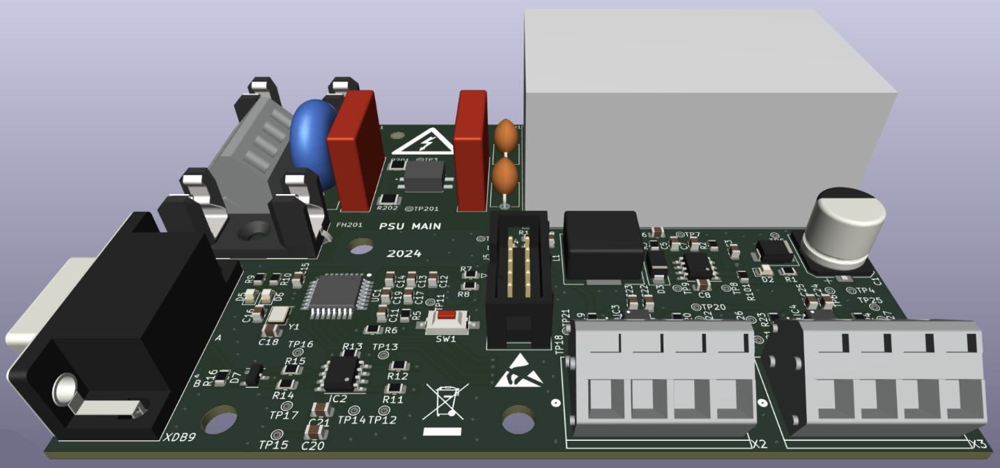
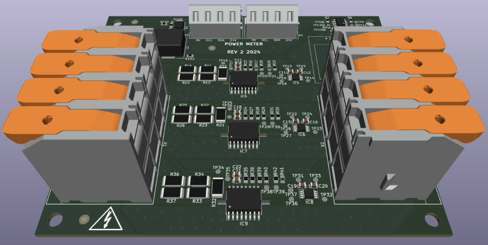
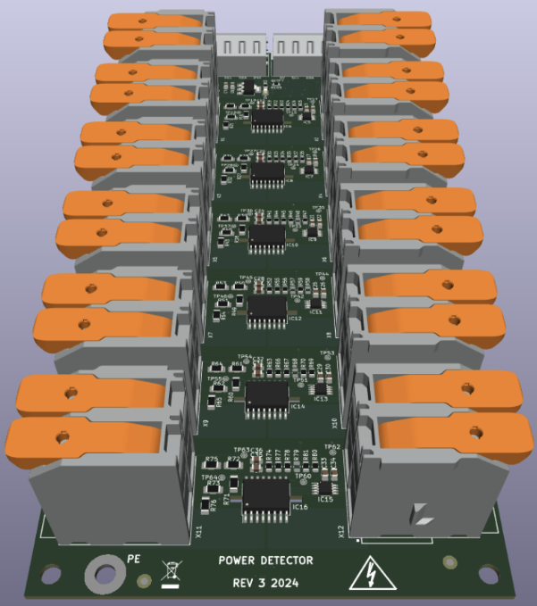

# POWER-MONITORING

## Summary
- System for high power distribution and monitoring
- Three-phase 440 VAC for military equipment
- Harsh environment and superior robustness application
- High safety specification devices
- 3 2-layer PCBs with interconnection harnesses

## Description
Sometimes, projects can be very complex. This system, in particular, involved several areas of expertise and required PCBs for specific tasks. Most of the architectural design for this system was done by an electrical engineer due to the power requirements and high voltage management. This equipment, called the Power Distribution Unit (PDU), was designed to power various military equipment inside a naval ship from AC three-phase power lines at 440V. The main requirement was to monitor the power consumption of all the equipment and integrate this electrical system into the ship's SCADA. These requirements involved a certain level of electronics to handle the sensors, telemetry, and communication with the native ship system.

The architecture and design of this project were truly complicated. The electrical part took months, and due to mechanical and wiring requirements that needed approval from the ship's engineering team, the electronics were also delayed. After several design iterations and reviews of technical documentation and compliance, the design was approved. This final proposal consists of 3 PCBs interconnected inside a metal cabinet (developed by a firm of mechanics specializing in electrical panels and cabinets) with the electrical equipment for safety and protection in high voltage.

Due to the reduced space and cable management inside the cabinet, it was decided to have a MAIN PCB connected directly to 440VAC to perform internal AC-DC conversion and power up the other two PCBs through cables. The MAIN PCB concentrates the power conversion (440VAC -> 24VDC), power filtering for EMI/EMC issues, the main processor (an industrial-grade PIC microcontroller for harsh applications), and interconnections to the other two PCBs and the external ship communication bus. The PCB interconnection protocol was I2C due to its ease of wiring and programming from a single microcontroller across three different PCBs with several peripherals.

The second board of this system is the POWER METER. This subsystem was in charge of measuring the total three-phase power consumption of the PDU and the connected loads. Additionally, this device has an OLED screen to locally display power measurements and complete system status. This display also serves for debugging purposes when there is no connection to the SCADA serial bus of the MAIN board. All peripherals inside this board are connected to one of the two MAIN microcontroller I2C buses.

The third and final PCB is the POWER DETECTOR. This board was responsible for detecting and measuring the activation of each load to individually characterize and report the state of each output power. The use of cage clamp connectors for power inputs/outputs, on both this and the POWER METER, was necessary to support high voltage and relatively high current of 20 A RMS. Also, these types of components were an electrical requirement to ensure the robustness and safety of the final wiring.

This ambitious product involved a lot of engineering work from different areas, and due to the high constraints and very specialized requirements, the development took almost 18 months to achieve a complete final design across all areas for prototyping and testing. The layout of each power meter IC was very demanding, requiring careful consideration of the current requirements for each trace and the creepage for high-voltage connections. The size and safety specifications for each board were also especially demanding in terms of design and manufacturing.

Undoubtedly, this project is one of the most complex I have ever been involved with. It provided tons of knowledge and hands-on experience from working with interdisciplinary teams, particularly with high-power topics.