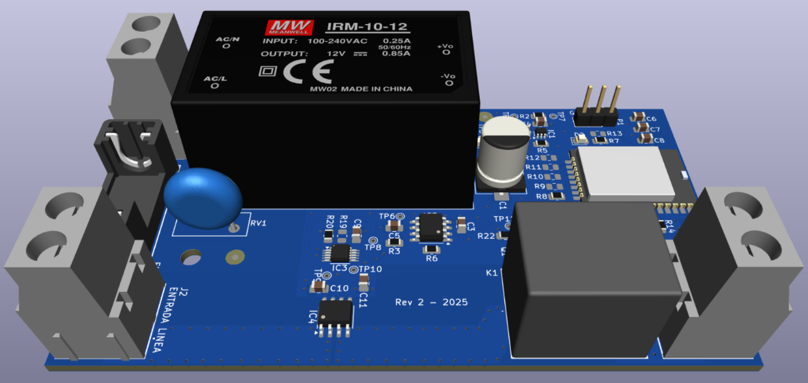
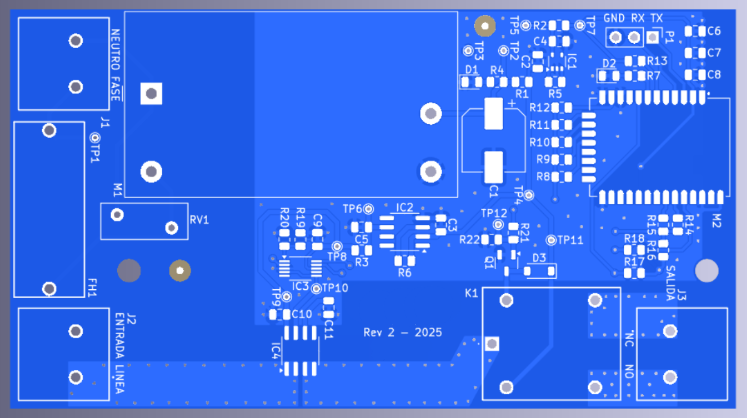

# CIRCUIT-CONTROLLER

## Summary
- Remote control of AC loads with current measurements
- Wireless communication for sensors and actuators
- XBee SoC without an external host
- 2-layer 2oz PCB for power applications
- 2025 KiCad V9 design

## Description
These kinds of IoT projects are very interesting because they involve several technical components. Besides hardware and firmware, you typically need to communicate wirelessly with a concentrator or repeater to exchange information with a cloud platform. In this case, this device aims to control the power consumption of specific AC loads (110-220VAC) according to a power efficiency algorithm. The device sends basic telemetry about its status and physical variables, plus the current consumption of the load, for post-processing in the cloud and feedback to the control algorithm.

The project began with a clear goal for a proof of concept for an important client. The idea was to create a working device that was as simple and inexpensive as possible to control AC loads up to 15 A, measuring the variables of interest with relatively high precision. Additionally, due to the specific application, the device had to operate robustly in the field, incorporating error detection, reliable firmware execution, and tested hardware to reduce the uncertainty of a first prototype manufacturing round.

The client's technology and operation were based on XBee technology, so the first step was to choose the right transceiver for this new product. After that, the design was built around this main component. Then, we decided to save costs by not having a microcontroller act as a modem host. With this decision, we had to carefully check the hardware capabilities of the XBee module to ensure the necessary firmware to control and manage external peripherals would fit properly.

We chose a well-known and thoroughly tested ADC, which we had used in other products, to obtain current measurements from a dedicated analog section featuring a high-precision magnetoresistive bidirectional current sensor. Additionally, the product includes a classic mechanical relay to handle load operation, similar to a ladder circuit (to allow for manual operation alongside automatic control).

The placement and routing of this device were carefully executed, but with a lot of confidence, given that we were familiar with 90 to 95% of the technology we were using. This allowed us to have the first complete design in a couple of weeks. And, without surprises, we achieved 100% functionality in the first version of the board, which only needed one design review. That is always an achievement when we talk about hardware products. After lab testing and some controlled conditions tests, we released this prototype for field tests, which showed very good performance in integration testing with all external parts of the system in a real application.

This project demonstrated the power of having a solid background and experience with certain types of devices, modules, or even technologies, as development times are massively accelerated. It's different when you read about it somewhere than when you experience it yourself. Ultimately, this speed in product development contributes to better returns and customer service.