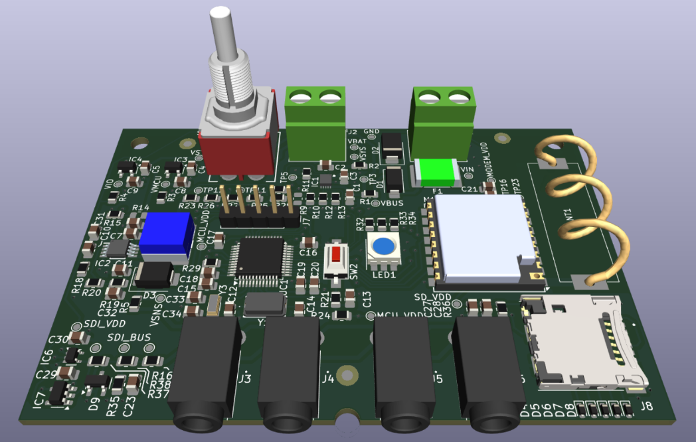
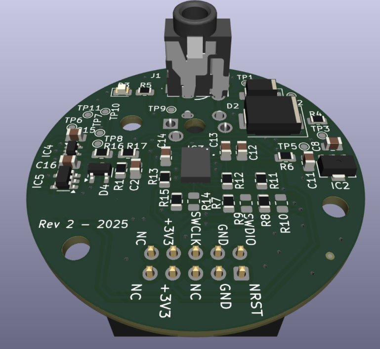

# LORA-SENSOR

## Summary
- System for monitoring geological data in remote areas
- IoT application based on LoRaWAN
- SDI-12 protocol for sensor communication
- Battery-powered system with solar panel recharging
- 2 PCBs for Main and Sensor boards designed in 2025

## Description
R&D projects are always very interesting because, more than aiming for the rapid deployment of thousands of devices, the objective is often to explore new technologies and find novel ways to solve long-existing or future problems. This project is a good example of this, as the client was a recognized university in the city, seeking this project for a public government entity. In a specific zone, there is a high geological risk due to unsafe constructions on mountains or unstable lands. This is problematic for the city, and the human and technological equipment needed to monitor it is insufficient. So, the proposed solution was an IoT sensor network that operates autonomously in those remote areas and can detect specific inertial variables to prevent disasters by landslides or earthquakes.

This project was relevant due to its community implications and the technical challenges involved. Creating a highly autonomous IoT device is somewhat "normal" or even expected, but having to handle more than 20 sensors for each node in this network posed a significant constraint for power consumption and battery management. The client required the use of LoRa modems for wireless communication and specific wired environmental sensors that operated on the SDI-12 protocol. Additionally, one week of purely battery autonomy was required, accompanied by the capability of a solar panel to recharge and maintain battery levels.

With that in mind, we proposed a Main board with power management circuitry (battery, chargers, converters, etc.), processing, and communication, along with an auxiliary board to connect wired environmental and IMU sensors. The main board was responsible for handling the battery, controlling peripheral sensors, backing up measurements, and transmitting information through the wireless LoRaWAN network. I decided to use an STM32 microcontroller with specific UART and SPI peripherals and a pre-made LoRa module to simplify the RF design. Also, I chose to interface all external sensors through the SDI-12 protocol to simplify firmware development and the required hardware, utilizing standard 3.5mm jack connectors.

This board features interesting components. I particularly liked its external appearance, especially the pigtail antenna for 915MHz communication and the SD card slot. I had to include a boost converter to power external sensors, which is controlled by the microcontroller to turn on and off and save battery when no measurements are being taken, and a tri-state buffer to handle the digital signals of the SDI-12 protocol. Also, I used a specific battery charger/monitor for solar panel applications (high-impedance voltage sources) with single-cell Li-ion batteries.

The main board went through 3 revisions in 2 iterations, where I had to refine the boost converter and battery charger circuits to adjust overall current consumption and meet the battery autonomy requirement. In that adjustments I had to add hardware capabilities for sleep mode and in board testing for final prototypes. 

Parallel to the main board, I designed the sensor board that connects to the main board through standard 3.5mm jack connectors and cables carrying VCC, SIGNAL, and GND. The SDI-12 protocol has the advantage of using a 1-wire setup to transmit digital signals, so I prioritized using this protocol across the entire system. The final cost of the solution was not as relevant as time to deliver a working prototype, which is why I decided to use the same microcontroller as the main board, but with significantly less core speed (70MHz Main vs 4MHz Sensor) to reduce power consumption and power losses in wired connections.

This board had specific size and mechanical constraints due to the application and the IMU sensor suggested by the client. Finally, this board had to read the IMU sensor, gather some additional parameters, and communicate as a slave with the Main board through the wired connection.

At the end of the project, I had to deliver a working system in a demo with the client and other stakeholders to demonstrate the operation of the devices and general system performance. In addition to this, I had to provide technical documentation and user manuals because the final deployment and the remaining work of the project were to be carried out by the client. I consider this a beautiful project for the collaboration between the academic and industrial sectors to create innovative solutions that help the community most in need and can ultimately save human lives. The potential applications for this type of solution are immense, and it only takes a little will to make them a reality.