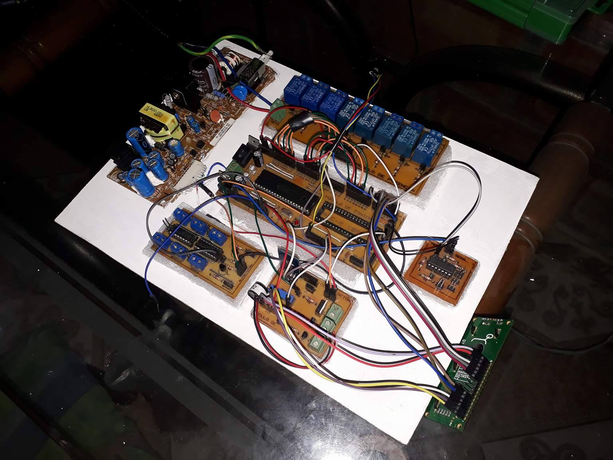
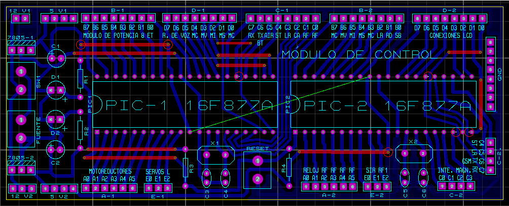
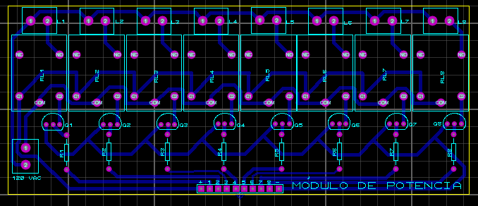
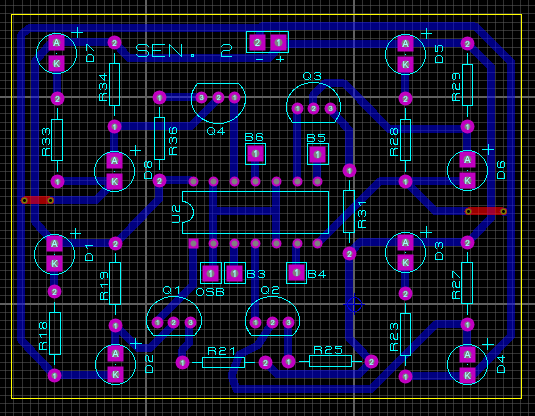
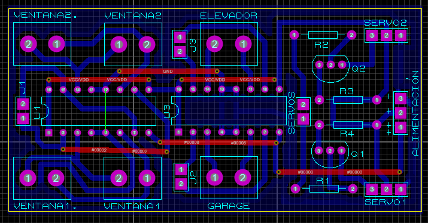
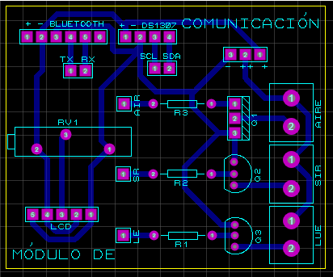
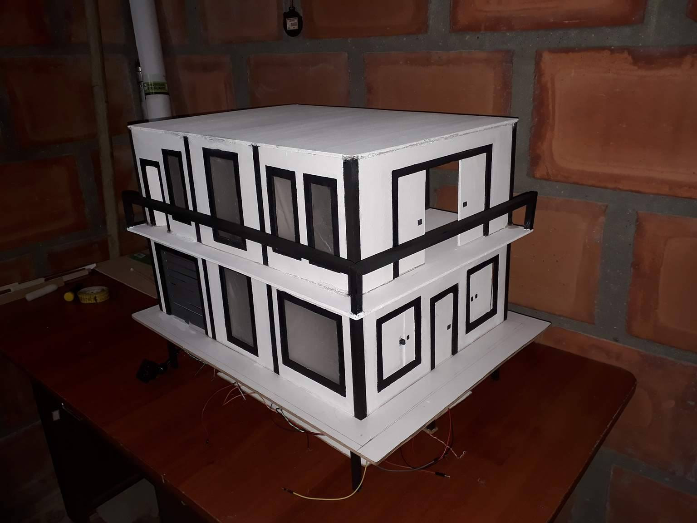

# MAFE

## Summary
- Degree project as a Technician in 2017 
- 8+ months of development
- 5 handmade single layer PCBs 
- 2 PIC Microcontrollers like in a dual core implementation
- Integration with Bluetooth app for remote control

## Description
This project was my degree project for the title of Technician in electricity and electronics. It condense all of my knowledge in electronics back then within an ambitious application of a fully automated house with remote control through Bluetooth. The project consist of a complete electronic system with all subcircuits to do things like control lights, open doors, set alarms, and even display information in a physical screen. The name of the project, MAFE, is an acronym in spanish of Automation Model for Conventional Houses (Modelo de Automatización Para Casas Convencionales).

MAFE electronic systems interconnected before final installation:

This project was design in PROTEUS 8 PROFESSIONAL with two PIC16F877A as main controllers programmed in C language with PIC C COMPILER and PICkit2. The 5 modules were design to avoid a single big complex PCB and ease of wiring inside the model house. The five module are:

- Control: Microcontrollers board with a bunch of IO for all the peripherals of this house. That top layer traces were really jumper wires.

- Power: Relays for high-power loads. This board is a 8-relay driver circuit with logic control signal of 5VDC for 110-220VAC loads.

- Sensors: Doors and windows switches. The circuit is used to connect reed switches and IR sensors to detect events in the house.

- Motors: For doors, windows, and garage actuators. This PCB have H-bridges and servo drivers to control movement parts in the house.

- Communication: Bluetooth and LCD circuits. Additionally, this includes transistorized drivers for DC loads like ambient light and sirens.

That project was big enough for my young self and all of those boards were designed, programmed and manufactured by myself so the AC-DC converter was extracted from an old printer to avoid the complex design of that power stage. Finally, the project worked pretty well, I obtained my Technician degree and the model house turn out great:

