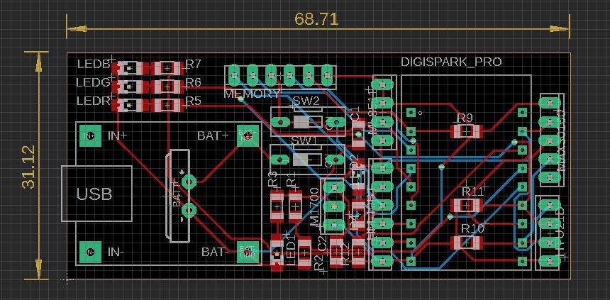
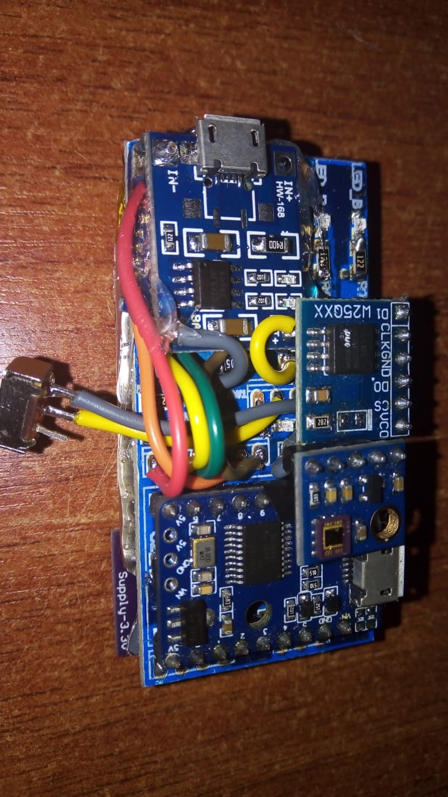
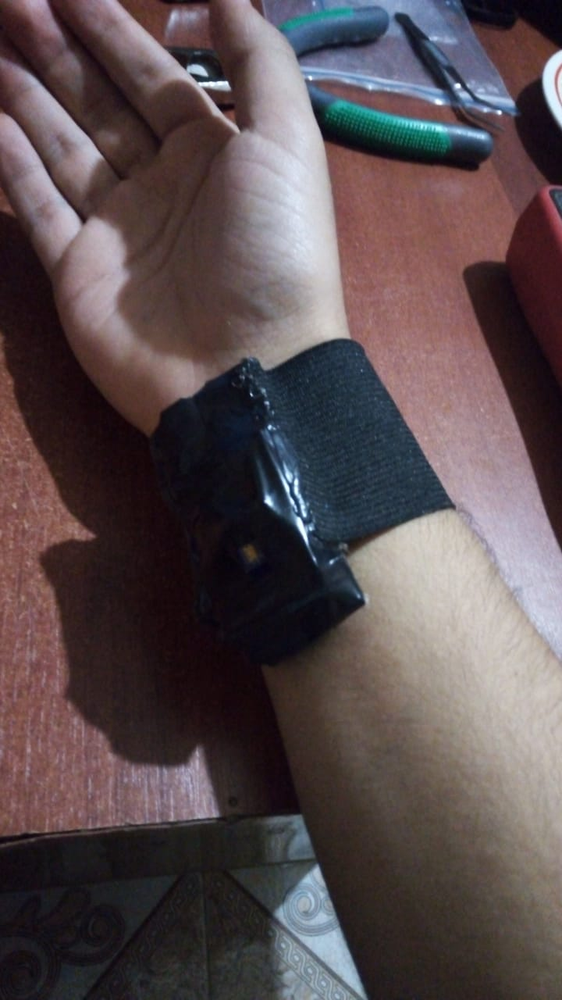

# WRISTBANDCARE

## Summary
- Undergraduate workshop course project in 2021 
- Portable device with Bluetooth and USB rechargable battery
- Quick prototype with modules integration
- Small 2-layer PCB with SMT and THT components

## Description
During my undergraduate studies in electronics engineering at the University I learned a lot about a bunch of differente topics. However, due to the accelerated pace and the amount of academic work that I carried on the course projects had to be quick prototypes and as functional as possible. This project is a clear example of this.

For a workshop course in the last year of university I had to choose a problem to solve with an electronic device. The problem that I choose was the health monitoring of people with wearable devices. In that years the wearables start to get high popularity. The proposed device have to measure heart rate and some environmental variables like temperature, humidity, and solar radiation to generate health recommendations for people based on their around and their heart activity. All of the measurements and communication with the device have to be wireless through Bluetooth and with a USB rechargable battery.

With that in mind I designed an integration board for some pre-made modules that combined met all the specs. The final design was a 68.71mm x 31.12mm PCB with 2 layers and a mix of passive SMT components with THT modules.

This simple PCB was the foundation for the device. In that particular project the manufacturing recommendations and best practices por PCB design were not even considered beacuse of hurry and nature of the handmade assembly of all project. The final integration of modules involve some important components like:

- Microcontroller ATtiny176 in a Digispark board
- UV Ligth Sensor ML8511
- HTU21D for environmental temperature and humitidy
- MAX30100 for oximetry and heart rate monitor
- SPI flash memory of 16MBit W25Q16BVSSIG
- BLE module JDY-23 with a CC2541 chip inside
- And some more for power management

All of that components needs to be fit in a wristband size!. But nothing that a solder iron and glue gun can't solve. I am still impressed with the magic that ones can do in a hole night of work. Here is a look of the internal PCB assembly:

Clearly for that academic project we didn't have any product designer, but the final goal of get a functional device was accomplished and we were able to send messages through Bluetooth with all variables measured and store back-up information inside the non-volatile flash memory. I clearly remember the tight constraint of code space that we had in that low-power microcontroller.

A pretty decent final device for a first time quick prototype with a bunch of hardware inside in a form on pre-made modules and wireless communication. Looking backwards this was an interesting project with real practical knowledge about electronics product development.