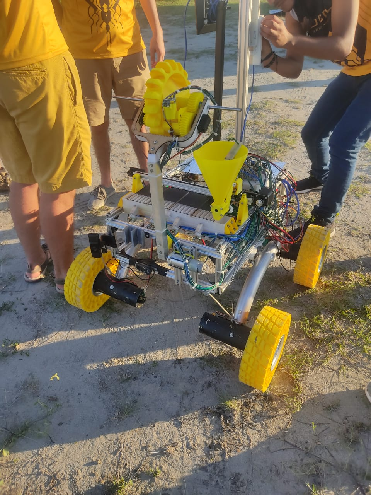
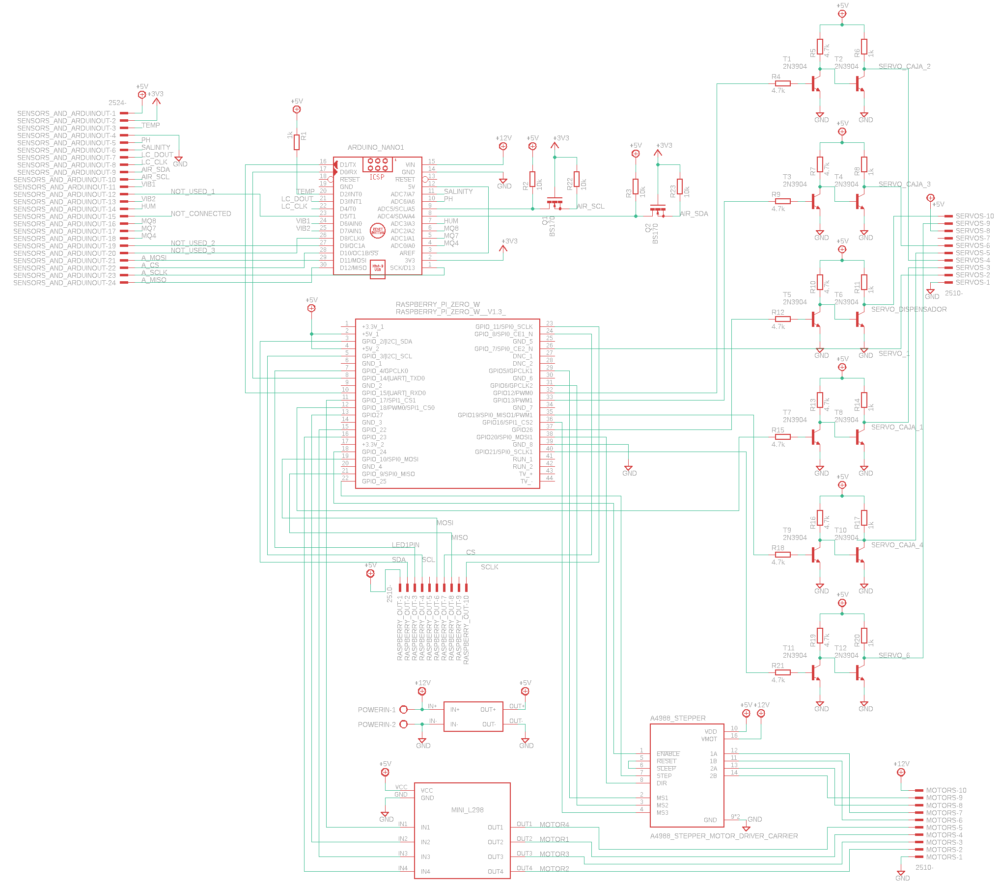
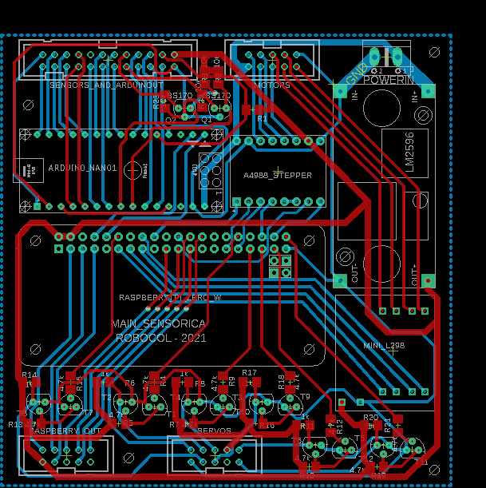
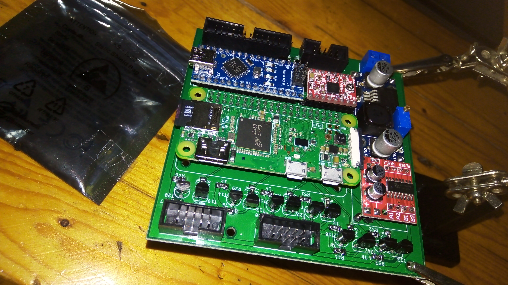
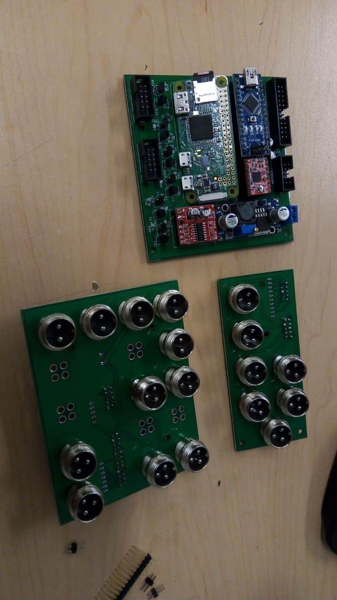
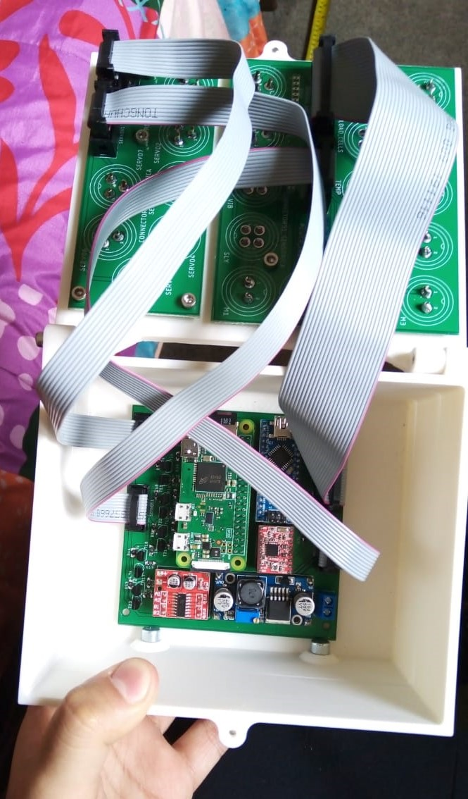

# WRISTBANDCARE

## Summary
- Scientific equipment for robotic student project 2020
- Dual processing with an Arduino UNO and a Rasperry Pi Zero W
- Sensors, Actuators and CAM control with ROS and baremetal code
- Integration boards with 2-layer layouts for main and connectors PCBs

## Description
Between 2020 and 2021 I was part of a robotics student team in my University with the purpose of developing a ROVER for international competitions such us URC (University Rover Challenge) and ERC (European Rover Challenge). I participate in the Sensory and Extraction team (the whole group was divided to work in specific robot subsystems). This team had the responsibility of developing the scientific team aboard the robot for different tests that involved, among others, the analysis of soils for the determination of extinct and existing life.

Complete ROVER in this photo

With that in mind the team decide to create EVA, which is an acronym in spanish of Alien Life Evaluator (Evaluador de Vida Alienígena). This electromechanical system was designed to extract, collect and analyse soil samples aboard the robot without any human intervention more than the supervision of chemical tests from the monitoring station. I was the main electronic designer of the Sensory and Extraction team and, together with the students of science and mechanics, we designed from the requirements this system that we could prototype and test in a desert relevant environment for the application.

Photo of this prototype in desert testing

The electronic system was a main board with processing and drivers for sensores measurement and actuators control and secondary PCBs for connectors. The main circuit looked like this:

Main schematic

Main layout

Main board assembled

That you can see the RPI and the Arduino with a bunch of connectors and premade modules. The goal here was to get a working prototype with the resources and capabilities that we had at that time. The final boards and final assembly in case looked like this:

Finally this system can control steppers, servos and other DC motors. In addition, this electronics can read gas sensors and transmit live camera video to the monitoring station to take photos and evidence of soil samples and chemical tests. 