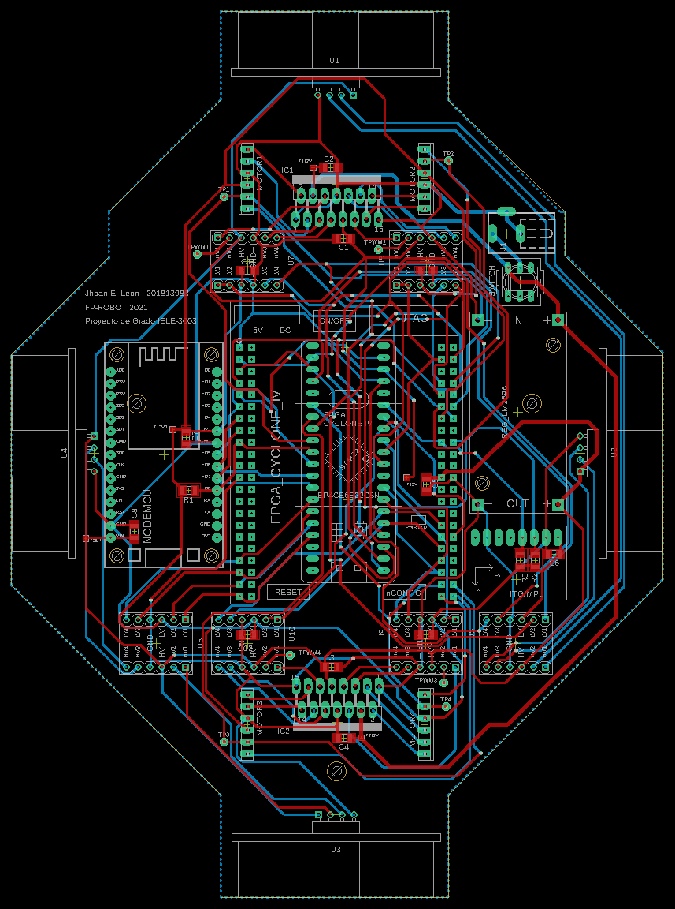
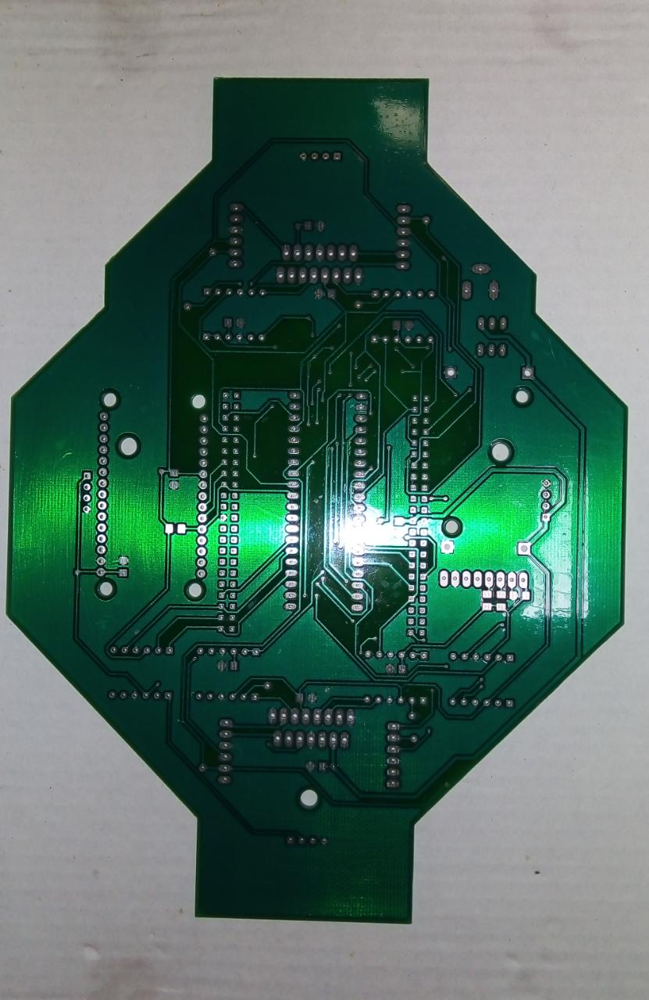
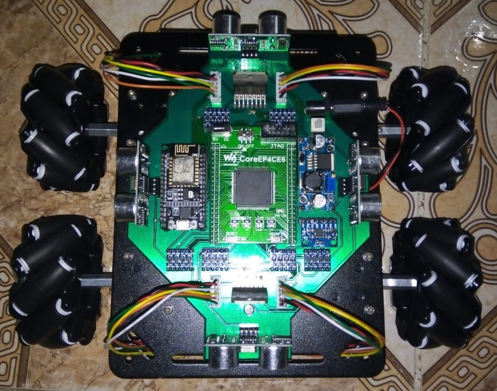
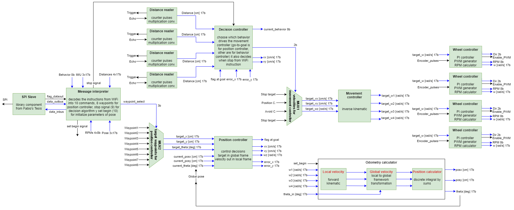

# FPGA-ROBOT

## Summary
- Degree project for Electronic Engineer in 2021
- Autonomous Mobile Robot with omnidirectional wheels
- 1 PCB with 2-layers for integration modules 
- FPGA based device with a NodeMCU as co-processor

## Description
This was my degree project for the title of Electronic Engineer at the University. During my studies, I was deeply interested in digital systems and FPGA design, and this project is a reflection of that interest. Through this project, I aimed to apply extensive knowledge in embedded systems and even robotics. The goal of this robot was to demonstrate the advantages of parallel hardware computing for highly concurrent tasks, such as in a robotics application, and to compare them with a typical processor.

The PCB for this robot had two layers and was designed in EAGLE. It was created to integrate all components in a compact way, in accordance with the robotic platform proposed for the project. This system consists of main processing boards and peripherals like power converters, voltage translators, ultrasonic sensors, and more.

This robot can move in any direction, thanks to its four omnidirectional wheels and the full drivers that independently control each one. The FPGA architecture was designed in 17-bit fixed-point format due to resource constraints inside the FPGA (initially, the architecture was proposed in 32-bit single-precision floating-point format). This hardware design calculates the robot's global position using odometry based on its wheel encoders and internal accelerometers. Additionally, it can perform path planning to move from point A to point B with autonomous navigation, including predefined reaction maneuvers to avoid object collisions.

Final robot assembly

The most challenging aspect of this project was the architecture design for the FPGA, given the real hardware constraints and the unforeseen events that projects of this complexity often entail. I developed the digital portion of the project using QUARTUS PRIME LITE, as the FPGA was an Intel Altera Cyclone V. The NodeMCU was programmed with Arduino to provide a graphical web interface for controlling the robot and monitoring its telemetry.

Finally, I successfully delivered the project on time with the expected functionality. I completed my degree in Electronics Engineering in 2021. Attached is a picture of the final FPGA design for a quick glance.

