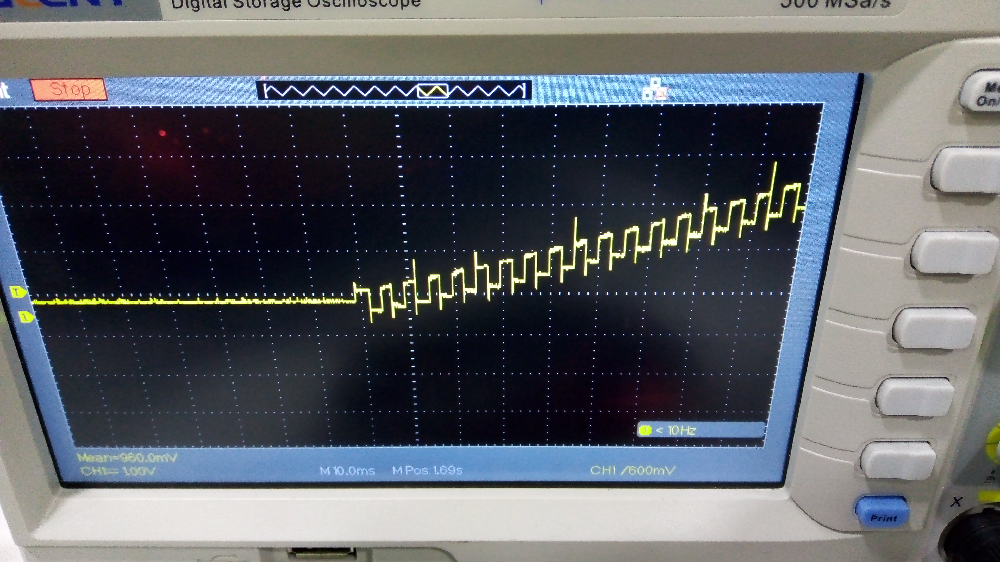

# VOLTAMMETRIC-EQUIPMENT

## Summary
- Firmware development for high-performance equipment
- RTOS needed to execute critical time tasks
- STM32H microcontroller family
- Hardware, Firmware, and Software integration

## Description
Right after college, I got my first job at a startup primarily focused on R&D projects for large companies interested in innovative solutions. I worked mainly on the embedded software and firmware side of these projects. We were all engineers on the team, striving to make this technology viable for deployment and sale to potential customers.

This equipment had to apply a specific voltage signal through electrodes to a chemical sample and measure the current generated at specific points of that voltage signal application. The timing in this application was critical and also needed to be parameterizable. These electrochemical techniques, called voltammetric, are applied to determine certain components in samples, such as heavy metals or other pollutants.

These photos came from a prototype in the lab when we were trying to prove the full system with real laboratory samples. This equipment required extensive scientific research and adjustment to obtain the right machine parameters for specific experiments and reagents.

I can't share too much about the project because the hardware and mechanical design weren't under my charge, but during the firmware development for this equipment, I gained valuable insights into product creation, testing, and validation of professional firmware, and finally, real-world applications that often have far more requirements than those encountered in university.