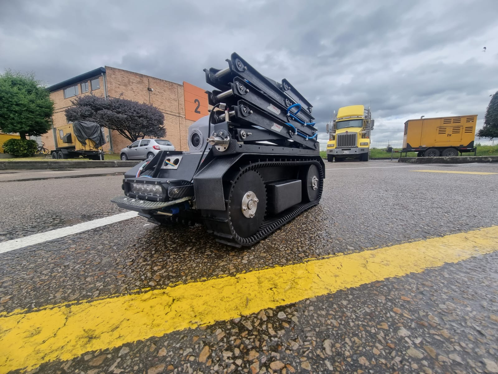

# INSPECTION-ROBOT

## Summary
- Teleoperated inspection robot for space-constrained environments
- Firmware development for an industrial-grade application microcontroller
- Motors and actuators control with real-time closed-loop algorithms
- Sensor and telemetry communication with serial protocols

## Description
This robot was a complete journey for me. When I joined the team, the robot was still in its early stages, particularly regarding the firmware and software integration. The boards were designed with a very limited microcontroller, which caused numerous operational problems. This robot was intended to be teleoperated by a 360-degree camera (transmitting in real-time to the base of operations) and a complete track system that also included a robotic arm to reach greater distances and collect measurements of different parameters along the way.

The firmware, based on the original MCU, was buggy and very difficult to maintain, scale, or even fix. So, it was decided to change the MCU on the board and use one with more features and according to the application. I completely designed the firmware for this new hardware, keeping architecture and future-proofing in mind. The board had to control motors for robot movement, as well as the robotic arm, and read several telemetry sensors to communicate its status to the remote platform. Also, several software closed-loop controllers were running in the code to execute precise movements. Additionally, security conditions were needed to ensure that the robot was safe to test and deploy in relevant field conditions.

This project was very ambitious, and the requirements weren't clear from the beginning about what this technology should achieve and how the robot would comply with all the client's needs. The development was complex, specifically concerning the mechanical and battery management aspects. Also, the hardware was challenging due to all the peripherals and components that needed to be powered, communicated with, and protected. During my time in the company, I worked on a solid firmware design and architecture in terms of code, to achieve the reliability and robustness that the project required. This involved a lot of study and trial-and-error on my part, providing me with great lessons about product development and the real engineering problems you encounter in projects of this magnitude.