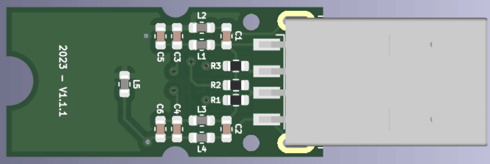

# AUDIO DONGLE

## Summary
- USB audio device developed for call center uses
- Optimization for audio quality and production costs
- Audio application with single-chip solution
- 29.5mm x 32.5mm 2-layer PCB
- +10k manufactured devices

## Description
This special project was my first mass-produced device, with thousands of units deployed in the market. The client required a very affordable audio dongle compatible with two specific headphone models from different brands. This device was intended for call center applications, where the quality of speakers and microphones is critical for both operators and clients.

The cost-effectiveness of this project was crucial because the product's volume was directly tied to its price. The single-chip solution appeared to be the best way to achieve this goal. However, the functional requirement was particularly demanding: the device had to deliver perfect sound quality with two different headphone brands. Initially, this seemed straightforward, but these headphone models had vastly different specifications, particularly in their speaker and microphone capabilities.

The first iteration of the design closely followed the main chip manufacturer's recommendations. While the sound quality was acceptable—albeit slightly low from the client’s perspective—with one headphone, the performance with the other headphone was much worse. This required several design iterations involving extensive simulations and passive filter studies to achieve optimal performance with both impedance profiles and speaker characteristics.

Back side of PCB

In this view, you can see the basic input and output filters for peripherals (stereo output and mono input). In the first iteration, we achieved complete USB functionality and key control through PC drivers (volume, mute, next, back, etc.). The chip performed exceptionally well. After numerous tests using both simulations and real boards, we identified the ideal filter values for the power rails, impedance matching, and noise attenuation.

Front side of PCB

The final PCB was very compact, but delivering excellent performance validated through simulations and lab testing. Ultimately, the client received the project’s MVP, which underwent field testing with a sample of 10 devices distributed across their call centers. These tests were excellent results, and the device entered production. The first batch of around 1,000 units was produced without any reported issues or defects. Subsequent production runs proceeded seamlessly. Today, these devices are distributed across Central and South America, with thousands of users benefiting from them.

This project was immensely rewarding for me. It marked my first experience contributing to the creation of a real electronic product, from conception to mass production, on this scale. Witnessing devices I designed being manufactured and used worldwide is an incredibly gratifying experience.
