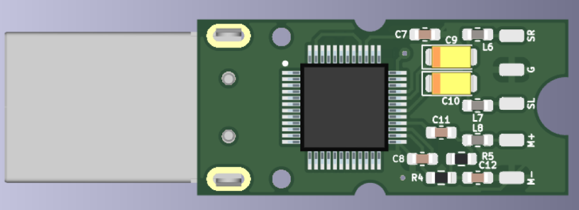

# AUDIO DONGLE

## Summary
- USB audio device developed for call center uses
- Optimization for audio quality and production costs
- Audio application with single-chip solution
- 29.5mm x 32.5mm 2-layer PCB
- +10k manufactured devices

## Description
This special project was my first mass produced device with thousands of products deployed in the market. The client requires a very cheap audio dongle to be compatible with two specific headphones of different brands. This device was intended for call center application when the quality of speakers and microphone is key to operators and clients. The solution was based in a single-chip solution.

The cos efecttiveness of this project was critical, because the volume of the product was attach to the price. The single-chip solution looked like the best way to acomplish this goal. However, the functional requirement was very demanding: the device have to sound perfectly with two different headphones brands. Initially that looked simple, but this headphone references had very different capabilities, specificially in speakers and micrphones specifications. 

The first iteration of the design was tight to the main chip manufacturer's recommendations. The sound was good, a little low from the client's perspective, but with only one headphone. The other one looks worse. This involved had to iterate the design with several rounds of simulations and passive filter study to achieve a good performance with both impedance profiles and speaker characteristics.

Back side of PCB

In this view there is the basic input and output filters for peripherals (stereo output and mono input). With the first iteration we get complete USB functionality and key control from PC drivers (volume, mute, next, back, etc.) and the chip performs really well. After several tests with simulation and real boards we find the best filter values for power rails and also for impedance matching and noise attenuation. 

Front side of PCB

The final PCB was really tiny, not so dense, but with a good performance validated in simulations and laboratory. Finally, the client got the MVP of the project and went to field testing with a sample of 10 devices to distribute between his call centers. That tests were excellent and production of the device began. The first batch was about 1000 devices, none presented any problems or guarantees. After that, more productions came and went seamlessly. These devices are currently distributed in center and south america with thousands of users.

This project was very gratifying for me, because I was able to participate in the creation of a real electronic product, from its conception to mass production, for the first time of this magnitude, and seeing those devices designed by yourself being manufactured for the world is a great feeling.