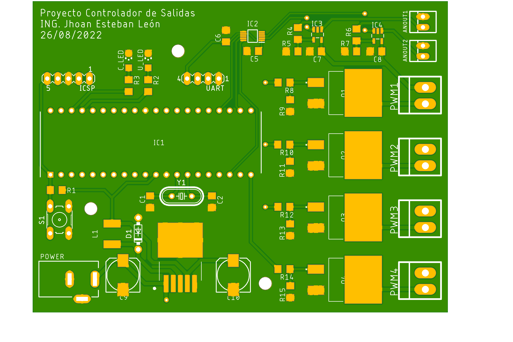

# OUTPUT CONTROLLER

## Summary
- Technical examination in 2022 
- 1 week for design, program and document
- Simple project with a single 2-layer PCB
- PIC Microcontroller with C programming
- EAGLE design and PROTEUS simulation

## Description
In 2022, I was seeking new job opportunities, and this project is special because it enabled me to secure a position as a hardware designer for a well-known electronics development company in my country. This design was part of the technical examination for this role, and I did my best to meet the requirements and time constraints I faced. The goal of this project was not to manufacture or prototype the final result. Instead, the objective was to showcase my hardware design and firmware programming skills through a typical project involving an output controller system using serial AT commands.

The requirements specified the operating voltage of the system and the number and type of outputs to be controlled. The circuit had to include analog and digital outputs, with AT commands for controlling range (analog 0–10 V), frequency, and duty cycle (digital PWM). My implementation for this project consisted of a PIC-based design with a buck converter for power input, power MOSFETs for digital outputs, and a DAC with operational amplifiers for analog outputs.

Final PCB Design

In simulations, my design and code performed as requested, although the project was never manufactured or tested in real life. Looking back, the design could have been improved. Specifically, the buck converter should have been routed differently to avoid large current loops and potentially mitigate noise issues. Additionally, despite the fact that specific analog precision was not required for this project, the analog section of the circuit could have been designed more meticulously to include a dedicated low-noise, low-variation source.

Ultimately, I presented the project and defended the decisions I made, which allowed me to secure the job. All of the design choices and code implementations had solid reasoning behind them, and this was really relevant to my new employers. The engineering criteria they recognized in my project gave me the opportunity to join the company. Through this project, I gained valuable feedback from more experienced engineers, which is incredibly important when aiming to grow professionally.