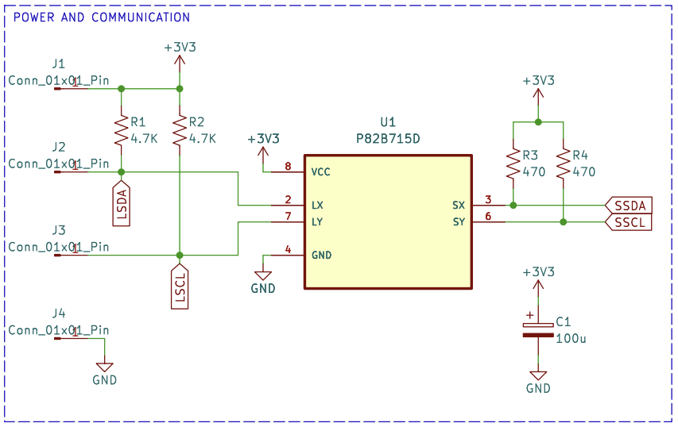
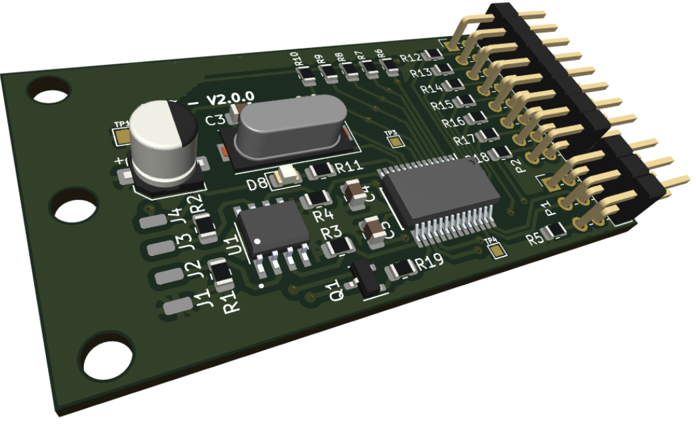

# KEYBOARD CONTROL

## Summary
- Membrane keyboard interface
- Long cable I2C port communication
- Modern low-power 8-bit PIC microcontroller
- 2-layer PCB designed with KiCad
- Gaming industry

## Description
Sometimes you have to design the complete system, but other times you have to add new features or devices to complement the operation of a main device. In this case, it is the former one. This project was an add-on for an already stablished board that controls some telemetry in gaming machines. The goals was to design a new membrane keyboard interface to integrate a fidelitiy mechanism to compensate recurrent users of these machines.

The critical part of this small board was the integration witn the main one since it only have one I2C port available to communicate with the membrane keyboard. Also, the device had to be installed 1 to 1.5 meters away from the main board. The main concern was the serial protocol performance over that distance, so the first part of the design focused on try to figure this out. After some research and validation the well-known I2C bus extender chip P82B715 from Texas Instruments was selected.

Final P82B715 circuit used in the design

The beauty of this circuit is the magic behind with the calculations for bus capacitance and rise time of I2C signals. Finally, this design worked without interruptions in the communication between processors on both boards. However, the power losses in the cable was a concern due to its length and the low voltage application. To manage this the hardware try to save precious miliamps in passive selection and the firmware was focused on low-power consumption from the MCU core.

Final PCB render

The final view of the board have some pin header for I2C bus and keyboard connection and mounting holes for mechanical subjection. These type of projects comes with interesting challenges that involves getting deep into details of some specific circuits. This design gave me a good time researching this protocol for wired use and debugging the final design with fine tuning of values and parameters.

Note: Sadly the P82B715D chip reference is obselete now (28/04/2025)