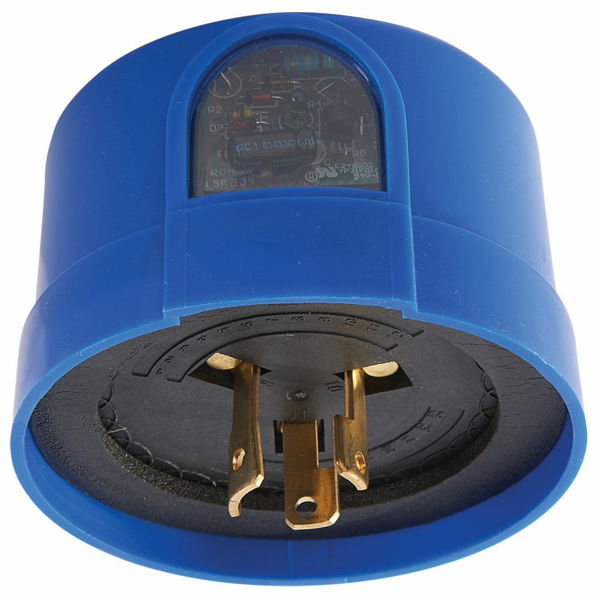
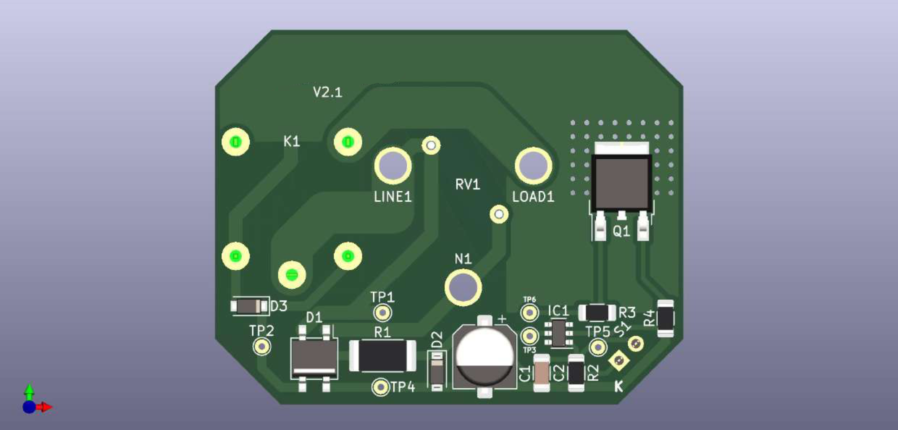

# PHOTOCONTROL

## Summary
- First big project for an external client
- Simplified design intended for low-cost production
- No MCU device, only discrete/analog logic
- 2 layer 2oz PCB for power application
- KiCad design

## Description
When I started as a hardware engineer in late 2022, this was the first project my manager entrusted to me. The goal was clear: to design a simplified photocontrol device to replace the Chinese version used, with the aim of mass production and distribution in Colombia (my home country).
This photocontrol is responsible for turning public lighting luminaires on and off based on the amount of luxes captured from the surroundings. The original device contained only THT components, and its design was more functional than robust: no fancy voltage regulators, no power protection, no microcontroller, just a straightforward 110–220 VAC connection and discrete logic.

Illustrative image of the target device

With this premise, I began the design. First, I chose SMT components to facilitate the assembly process and modernize the design, moving away from that Chinese style of 80s electronics. Then, I made plenty of mistakes: incorrect track size calculations, poor component selection, and, of course, the challenge of meeting regulations for this equipment with minimal resources.

This was a real challenge for me due to the requirements of working directly with 110–220 VAC and navigating the strict regulations for the operation and manufacturing of this equipment. I remember that the first prototypes exploded certain components as soon as they were connected to the 110 VAC power supply. Some heat in some power components, and so on. Over time, the design was refined and was eventually able to handle the full range of input AC voltage without any issues. The next hurdle was meeting the standard lux requirements for the application. Interestingly, regulations prohibit the use of photoresistors, mandating the use of photodiodes or phototransistors instead. The calibration process for this device was anything but easy. We spent countless hours in a dark laboratory measuring the precise lux levels for the lamp. In the end, I successfully completed the design and delivered it to the client’s satisfaction.

Render view (with hidden sensitive information) of final version of the device

Finally, we built three prototypes (v1.0, v2.0, and v2.1) until we met all the requirements. That iterative process provided me with valuable insights into the industry and how real products are developed for the market. It was during this project that I truly understood electronics is a volume business, no matter how much you optimize or refine your hardware design, if the production volume isn’t right, the product will never be feasible.

Unfortunately, this device never came to market and the project ended there because the client was never able to secure suitable supplier for manufacturing.
